# MDP（Markov Decision Process）

## Introduction

- MDPs are a classical formalization of sequential decision making
- Actions influence immediate rewards, subsequent states, and future rewards
- MDPs involve delayed reward
- Need to trade of immediate and delayed reward

MDP是序列决策的表达形式，其当前动作不光影响及时收益，同时影响后续的状态和未来收益，因此涉及到延迟收益，需要权衡及时收益和延迟收益。

## The Agent–Environment Interaction

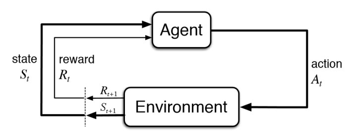

- Agent: the learner and decision maker
- Environment: everything outside the agent

Markov Decision Process can model a lot of real-world problem. It formally describes the framework of reinforcement learning. Under MDP, the environment is fully observable. Partially observable problems can be converted into MDP.

agent和环境持续的交互过程：agent得到一个状态后，采取一个动作，环境对此做出响应，并进入下一个状态，把下个状态传回给agent。同时环境会产生一个收益，通常是特定数值，也就是agent在动作选择过程中想要最大化的目标。这个交互过程可以通过马尔可夫决策过程表示，MDP是强化学习的基本框架。在MDP中，环境是全部可观测的，对于部分观测问题也可转换为MDP问题。

- 状态集 $S_{t} \in \mathcal{S}$: each time step t, agent receives the environment’s state
- 动作集 $A_{t} \in \mathcal{A}(s)$: agent on that basis selects an action on that basis
- 收益集 $R_{t+1} \in \mathcal{R} \subset \mathbb{R}$: as a consequence of its action, the agent receives a numerical reward

> 使用 $R_{t+1}$ 是为了强调下一时刻的收益和下一时刻的状态是被环境一起决定的，但文献中也会使用 $R_{t}$。

## Dynamics Function P

有限MDP中，随机变量$S_{t}$和$R_{t}$具有定义明确的离散概率分布，并仅与前继的状态和动作有关。在给定s和a后，$s^{\prime}$ 和 $r$ 在t时刻出现的概率用**四参数动态函数p**表示：
$$
p\left(s^{\prime}, r \mid s, a\right) \doteq \operatorname{Pr} \left\{S_{t}=s^{\prime}, R_{t}=r \mid S_{t-1}=s, A_{t-1}=a \right \}
$$

函数p定义了MDP的动态特性（dynamics），函数p：$\mathcal{S} \times \mathcal{R} \times \mathcal{S} \times \mathcal{A} \rightarrow[0,1]$是有四个参数的确定性函数。函数p完全表达了MDP的动态信息。函数p满足归一性：
$$
\sum_{s^{\prime} \in \mathcal{S}} \sum_{r \in \mathcal{R}} p\left(s^{\prime}, r \mid s, a\right)=1, \text { for all } s \in \mathcal{S}, a \in \mathcal{A}(s)
$$

注意：四参数函数p是给定了前继状态和动作后，状态信号和收益信号二元组出现的概率。其中收益信号同样满足一个分布，即在s，a，s’ 均确定的情况下，r的值是不确定的（虽然有些模型只定义了从s1进入s2的收益为1），故需要两次积分。

- State-transition probabilities（三参数函数p：$\mathcal{S} \times \mathcal{S} \times \mathcal{A} \rightarrow[0,1]$）

    状态转移概率函数：不考虑收益，只考虑状态的转移。
    $$
    p\left(s^{\prime} \mid s, a\right) \doteq \operatorname{Pr}\left\{S_{t}=s^{\prime} \mid S_{t-1}=s, A_{t-1}=a\right\}=\sum_{r \in \mathcal{R}} p\left(s^{\prime}, r \mid s, a\right)
    $$
    
    State-transition matrix P 表示为：
    $$
    P=\left[\begin{array}{cccc}P\left(s_{1} \mid s_{1}\right) & P\left(s_{2} \mid s_{1}\right) & \ldots & P\left(s_{N} \mid s_{1}\right) \\P\left(s_{1} \mid s_{2}\right) & P\left(s_{2} \mid s_{2}\right) & \ldots & P\left(s_{N} \mid s_{2}\right) \\\vdots & \vdots & \ddots & \vdots \\P\left(s_{1} \mid s_{N}\right) & P\left(s_{2} \mid s_{N}\right) & \ldots & P\left(s_{N} \mid s_{N}\right)\end{array}\right]
    $$
    注意：这里的状态转移矩阵P和状态转移概率函数p不同，应有：$p\left(s^{\prime} \mid s \right) = \sum_{a \in \mathcal{A}} {\pi}(a \mid s) p\left(s^{\prime}\mid s, a\right)$

## MDP Framework

MDP框架是对于有目标的交互式学习问题的抽象，学习问题都可以概括成agent和环境来回传递的三个信号：

- 动作信号：表示agent做出的选择
- 状态信号：表示agent做出选择的基础
- 收益信号：定义agent的目标

MDP框架并不能有效地表示所有目标导向的学习任务，核心就是该任务是否满足马尔可夫性质。对于打扑克，之前所有打出的牌都会对剩下的牌堆造成影响。

## Markov Property

The history of states: $ h_{t}=\{s_{1}, s_{2}, s_{3}, \ldots, s_{t}\} $

State $s_{t}$ is Markovian if and only if: 
$$
p\left(s_{t+1} \mid s_{t}\right)=p\left(s_{t+1} \mid h_{t}\right)
$$

$$
p\left(s_{t+1} \mid s_{t}, a_{t}\right)=p\left(s_{t+1} \mid h_{t}, a_{t}\right)
$$

Markov Property: The future is independent of the past given the present.

对于MDP，状态仅取决于前继状态和前继动作而与更早的状态和动作完全无关，因此状态这个参数被认为具有马尔可夫性质。

## Markov Process/Markov Chain

一个MDP可以由转移表格和状态转移图表示。如一个回收机器人的任务是收集罐子：

- 动作集：{寻找、等待、充电}
- 状态集是：{高电量，低电量}（并规定高电量不会充电）
- 收益：每收集一个罐子作为一个单位收益，状态电量耗尽需人工充电收益为-3，r(寻找)>r(等待)
- 转移概率：定义了 $\alpha$  和 $\beta $

状态转移概率和转移的期望收益表示如下图：

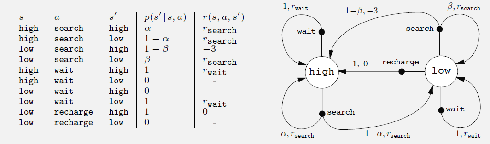

State nodes（状态节点）：每个状态都有一个状态节点 s，大空心圆

Action nodes（动作节点）：每个“状态，动作”都有一个动作节点 (s, a)，小实心圆+连线

从状态s开始，执行动作a，会顺着连线从状态节点到达动作节点，然后环境做出响应，通过离开运动节点的箭头，转移到下一个状态节点 s' 。每个箭头都对应了“状态，动作，后继状态”。特别注意，从一个动作节点流出的概率和应为1。

四参数动态函数p表示如下图：

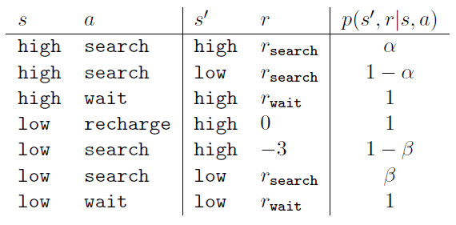

有了马尔可夫链（状态转移图）后，就可以取样，获得很多的子序列（幕，轨迹）。

Sample episodes（幕）starting from s3：

s3; s4; s5; s6; s6

s3; s2; s3; s2; s1

s3; s4; s4; s5; s5

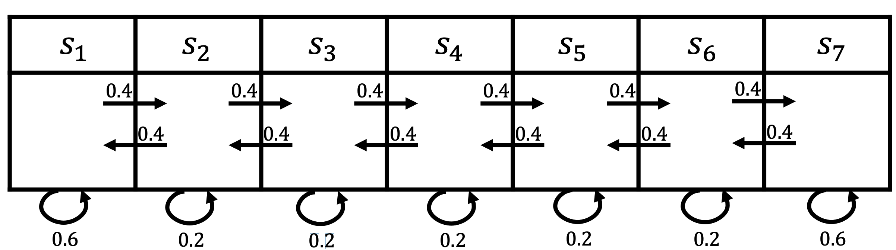

## Rewards

agent的目标被形式化表示为收益信号，通过环境传给agent。每个时刻，收益都是单一的标量 $R_{t} \in \mathbb{R}$。agent的目的就是最大化其收到的总收益。对于MDP，收益r是一个随机变量，满足一个分布。

**Reward hypothesis（收益假设）**

That all of what we mean by goals and purposes can be well thought of as the maximization of the expected value of the cumulative sum of a received scalar signal (called reward).

> 我们所有的目的可以归结为：最大化agent收到的收益累积和的概率期望值。

设立收益的方式要能真正表明我们的目的。收益信号只能用来传达什么是agent要实现的目标，而不是如何实现这个目标。例如在围棋中，我们可以设立获胜收益为+1，失败和平局为-1。只有获胜才能获得收益，吃掉对方的子（子目标）是不能获得收益的，这样agent就可能为了吃掉对方的子而输掉比赛。

- Expected rewards for state–action pairs（双参数函数r：$\mathcal{S} \times \mathcal{A}  \rightarrow \mathbb{R}$）

    “状态-动作”二元组的期望收益。

$$
r(s, a) \doteq \mathbb{E}\left[R_{t+1} \mid S_{t}=s, A_{t}=a\right]=\sum_{r \in \mathcal{R}} r \sum_{s^{\prime} \in \mathcal{S}} p\left(s^{\prime}, r \mid s, a\right)
$$

- Expected rewards for state–action–next-state triples（三参数函数r：$\mathcal{S} \times \mathcal{A} \times \mathcal{S} \rightarrow \mathbb{R}$）

    “状态-动作-后继状态”三元组的期望收益。
    $$
    r\left(s, a, s^{\prime}\right) \doteq \mathbb{E}\left[R_{t+1} \mid S_{t}=s, A_{t}=a, S_{t+1}=s^{\prime}\right]=\sum_{r \in \mathcal{R}} r \frac{p\left(s^{\prime}, r \mid s, a\right)}{p\left(s^{\prime} \mid s, a\right)}
    $$

- Expected rewards for state

    “状态”的期望收益。

$$
r\left(s\right) \doteq \mathbb{E} \left[R_{t+1} \mid S_{t}=s\right]=\sum_{a} \pi(a \mid s) \sum_{s^{\prime}, r} r p\left(s^{\prime}, r \mid s, a\right)
$$

$$
r\left(s\right) = \sum_{a} \pi(a \mid s)r(s, a)
$$

## Returns

时刻 t 后agent接收的收益信号序列表示为：$R_{t+1}, R_{t+2}, R_{t+3}, \ldots$

我们寻求最大化期望回报 $G_{t}$，回报是收益的总和。

**Episodic tasks（分幕式任务）：**每幕有终结状态（terminal state）随后从某状态样本重复开始。T为最终时刻。
$$
G_{t} \doteq R_{t+1}+R_{t+2}+R_{t+3}+\cdots+R_{T}
$$

> 在分幕式任务中，有时需要区分非中介状态集 $\mathcal{S}$ ，和所有状态集 $\mathcal{S}^{+}$。
>
> Horizon (T): Number of maximum time steps in each episode，是个随机变量，因幕不同而不同。

**Continuing tasks（持续性任务）：**agent和环境的交互在不断的发生，$T=\infty $。
$$
G_{t} \doteq R_{t+1}+\gamma R_{t+2}+\gamma^{2} R_{t+3}+\cdots=\sum_{k=0}^{\infty} \gamma^{k} R_{t+k+1}
$$
$\gamma$ 表示折合率，$0 \leq \gamma \leq 1$。折合率决定了未来收益的现值。如何折合率为0，agent就是目光短浅的，只关心最大化及时收益。随着折合率接近1，agent会越来越有远见。从公式中可以发现，越往后的收益折扣的越多，这是因为我们更期待更快地获得收益。

注意： $G_{t}$ = $G_{t} \mid S_{t}=s$ , 且对任意下标都有该隐藏的条件，因为回报总是考虑当前开始，往后所有收益的和。在数学推导上需要补充这个条件。

> **Why Discount rare** 
>
> - Avoids infinite returns in cyclic Markov processes
>- Uncertainty about the future may not be fully represented
> - If the reward is financial, immediate rewards may earn more interest than delayed rewards Animal/human behavior shows preference for immediate reward
>- Animal/human behavior shows preference for immediate reward

相邻时刻的回报有递归式（VERY IMPORTANT）：
$$
\begin{aligned}
G_{t} & \doteq R_{t+1}+\gamma R_{t+2}+\gamma^{2} R_{t+3}+\gamma^{3} R_{t+4}+\cdots \\
&=R_{t+1}+\gamma\left(R_{t+2}+\gamma R_{t+3}+\gamma^{2} R_{t+4}+\cdots\right) \\
&=R_{t+1}+\gamma G_{t+1}
\end{aligned}
$$
注意：如果$G_{T}=0$，上式对任意时刻都成立，这会简化从收益序列计算回报的过程。也就是**反向计算**。

**迷宫问题**

设计一个走迷宫的agent，当逃脱时收益为+1，其余为0，分幕式任务。训练一段时间后，agent的能力不再增加。如果让agent一直随机运动，最终都会逃离终点，每一幕的回报G也都是1。而实际上我们需要的是尽快逃脱迷宫。另外，agent可能会陷入循环，需要额外的规则让agent进入最终状态（终点）。

**Unified Notation**

对于分幕式任务，一般地应表示为：$S_{t, i}$，其中i表示幕，t表示幕中的时刻。但往往只用 $S_{t}$表示。

如果把幕的终止看成一个吸收状态（absorbing state），只会转移到自己且只产生零收益。那么就可以将两个任务的回报统一表示：
$$
G_{t} \doteq \sum_{k=t+1}^{T} \gamma^{k-t-1} R_{k}
$$
其中，允许 $T=\infty$ or $\gamma=1$ (but not both)。

## Policy

- A policy is the agent’s behavior model
- It is a map function from state/observation to action.
- Stochastic policy: Probabilistic sample $\pi(a \mid s)=P\left[A_{t}=a \mid S_{t}=s\right]$
- Deterministic policy: $a^{*}=\arg \max \pi(a \mid s)$

policy决定了agent的行为。这个函数的输入是状态，输出是动作，实际上是从状态到每个动作的选择概率之间的映射。分为两种：随机策略和决定性策略。$\pi(a \mid s)$ 表示在状态s选择动作a的概率，是个普通函数。对每个 $s \in \mathcal{S}$ 都定义了在 $a \in \mathcal{A}$ 上的概率分布。

**Stochastic policy（随机策略）**

输入一个状态s，所有的动作都有一个概率（如向上的概率为0.3，向下的概率为0.7）；然后对这个分布进行采样（sample），最后获得实际采取的动作。

**Deterministic policy（决定性策略）**

输入一个状态s，采取极大化（最有可能的概率），提前决定好所有的动作中有一个概率为1，即一直采取这个动作。

## Value Function

价值函数是状态（或状态-动作）的函数，用来评估当前agent在给定的 状态（状态-动作）下**有多好**。**有多好**是用未来预期的收益来定义的，也就是回报的期望。也可以理解为在进入某个状态（进入某个状态并采取某个工作）在未来可能获得多少价值。**简单来说，价值就是回报的期望。**

**状态价值（State-value function）**

状态价值表示从状态 s 开始，按照策略 $\pi$ 进行决策所获得的回报的概率期望值（expected return）。简单来说，一个状态的价值就是从该状态开始的期望回报。
$$
v_{\pi}(s) \doteq \mathbb{E}_{\pi}\left[G_{t} \mid S_{t}=s\right]=\mathbb{E}_{\pi}\left[\sum_{k=0}^{\infty} \gamma^{k} R_{t+k+1} \mid S_{t}=s\right], \text { for all } s \in \mathcal{S}
$$
注意：终止状态的价值始终为0。

动作价值函数（action-value function）的定义是 $q_{\pi}(s, a)$ ，表示按照策略 $\pi$ ，在状态 s 时采取动作 a 所获得的回报的概率期望值。
$$
q_{\pi}(s, a) \doteq \mathbb{E}_{\pi}\left[G_{t} \mid S_{t}=s, A_{t}=a\right]=\mathbb{E}_{\pi}\left[\sum_{k=0}^{\infty} \gamma^{k} R_{t+k+1} \mid S_{t}=s, A_{t}=a\right]
$$
The relation between $v_{\pi}(s)$ and $q_{\pi}(s, a)$ :
$$
v_{\pi}(s)=\sum_{a} \pi(a \mid s) q_{\pi}(s, a)
$$

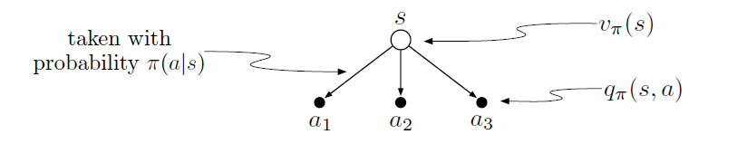

The relation between $q_{\pi}(s, a)$ and $v_{\pi}(s’)$ :
$$
\begin{aligned}
q_{\pi}(s, a) &=\mathbb{E}_{\pi}\left[R_{t+1}+{\gamma} v_{\pi}\left(s^{\prime}\right) \mid S_{t}=s, A_{t}=a\right] \\
&=\sum_{s^{\prime}, r} p\left(s^{\prime}, r \mid s, a\right)\left[r+{\gamma} v_{\pi}\left(s^{\prime}\right)\right]
\end{aligned}
$$
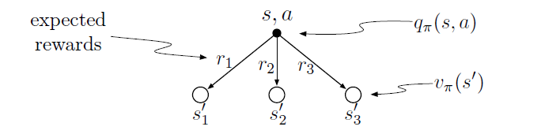

如果agent遵循策略 $\pi$ ，记录每个状态后的实际回报，并求得平均值，当状态出现次数趋于无穷时这个平均值会收敛于v；同理如果在每个状态选择固定的动作，平均值会收敛于q。这种估算方法称为蒙特卡洛方法（Monte
Carlo methods）：从真实回报的多个随机样本中求平均值。

## Bellman Equation

对于MRP，贝尔曼方程如下：
$$
V(s)=\underbrace{R(s)}_{\text {Immediate reward }}+\underbrace{\gamma \sum_{s^{\prime} \in S} P\left(s^{\prime} \mid s\right) V\left(s^{\prime}\right)}_{\text {Discounted sum of future reward }}
$$

$$
\left[\begin{array}{c}V\left(s_{1}\right) \\V\left(s_{2}\right) \\\vdots \\V\left(s_{N}\right)\end{array}\right]=\left[\begin{array}{c}R\left(s_{1}\right) \\R\left(s_{2}\right) \\\vdots \\R\left(s_{N}\right)\end{array}\right]+\gamma\left[\begin{array}{cccc}P\left(s_{1} \mid s_{1}\right) & P\left(s_{2} \mid s_{1}\right) & \ldots & P\left(s_{N} \mid s_{1}\right) \\P\left(s_{1} \mid s_{2}\right) & P\left(s_{2} \mid s_{2}\right) & \ldots & P\left(s_{N} \mid s_{2}\right) \\\vdots & \vdots & \ddots & \vdots \\P\left(s_{1} \mid s_{N}\right) & P\left(s_{2} \mid s_{N}\right) & \ldots & P\left(s_{N} \mid s_{N}\right)\end{array}\right]\left[\begin{array}{c}V\left(s_{1}\right) \\V\left(s_{2}\right) \\\vdots \\V\left(s_{N}\right)\end{array}\right]
$$

$$
V=R+\gamma P V
$$

对于MDP，贝尔曼方程如下：
$$
\begin{aligned}
v_{\pi}(s) & \doteq \mathbb{E}_{\pi}\left[G_{t} \mid S_{t}=s\right] \\
&=\mathbb{E}_{\pi}\left[R_{t+1}+\gamma G_{t+1} \mid S_{t}=s\right] \\
&=\sum_{a} \pi(a \mid s) \sum_{s^{\prime}} \sum_{r} p\left(s^{\prime}, r \mid s, a\right)\left[r+\gamma \mathbb{E}_{\pi}\left[G_{t+1} \mid S_{t+1}=s^{\prime}\right]\right] \\
&=\sum_{a} \pi(a \mid s) \sum_{s^{\prime}, r} p\left(s^{\prime}, r \mid s, a\right)\left[r+\gamma v_{\pi}\left(s^{\prime}\right)\right], \quad \text { for all } s \in \mathcal{S}
\end{aligned}
$$

$$
\begin{aligned}
q_{\pi} & \doteq \mathbb{E}_{\pi}\left[G_{t} \mid S_{t}=s, A_{t}=a\right] \\
&=\mathbb{E}_{\pi}\left[R_{t+1} \mid S_{t}=s, A_{t}=a\right]+\gamma \mathbb{E}_{\pi}\left[G_{t+1} \mid S_{t}=s, A_{t}=a\right] \\
&=\sum_{s^{\prime}, r} p\left(s^{\prime}, r \mid s, a\right) r+\gamma \sum_{s^{\prime}, r} p\left(s^{\prime}, r \mid s, a\right) \sum_{a^{\prime}} \pi\left(a^{\prime} \mid s^{\prime}\right) \mathbb{E}_{\pi}\left[G_{t+1} \mid S_{t+1}=s^{\prime}, A_{t+1}=a^{\prime}\right] \\
&=\sum_{s^{\prime}, r} p\left(s^{\prime}, r \mid s, a\right)\left[r+\gamma \sum_{a^{\prime}} \pi\left(a^{\prime} \mid s^{\prime}\right) q_{\pi}\left(s^{\prime}, a^{\prime}\right)\right]
\end{aligned}
$$

The value of the start state must equal the (discounted) value of the expected next state, plus the reward expected along the way. 

贝尔曼方程表示了状态之间的递推关系。起始状态的价值一定等于后继状态的（折扣）价值期望加上对应的收益期望。回溯图可以清晰地表达这种状态。回溯实际就是讲后继状态（状态-动作）的价值信息回传给当前时刻的状态（状态-动作）。

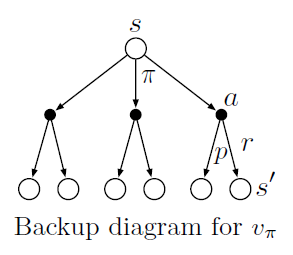

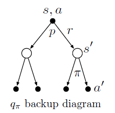

## Optimal Policies and Value Functions

最优策略：$\pi \geq \pi^{\prime}$ if and only if $v_{\pi}(s) \geq v_{\pi^{\prime}}(s)$

我们总能找到至少一个策略不劣于其他策略， $\pi_{*}$ 表示所有这些最优策略，它们共享最优价值函数：
$$
v_{*}(s) \doteq \max _{\pi} v_{\pi}(s)  \text { for all } s \in \mathcal{S}
$$

$$
q_{*}(s, a) \doteq \max _{\pi} q_{\pi}(s, a)
$$

贝尔曼最佳方程（Bellman optimality equation）：最优策略下，各个状态的价值一定等于该状态下最优动作的回报期望。
$$
\begin{aligned}
v_{*}(s) &=\max _{a \in \mathcal{A}(s)} q_{\pi_{*}}(s, a) \\
&=\max _{a} \mathbb{E}_{\pi_{*}}\left[G_{t} \mid S_{t}=s, A_{t}=a\right] \\
&=\max _{a} \mathbb{E}_{\pi_{*}}\left[R_{t+1}+\gamma G_{t+1} \mid S_{t}=s, A_{t}=a\right] \\
&=\max _{a} \mathbb{E}\left[R_{t+1}+\gamma v_{*}\left(S_{t+1}\right) \mid S_{t}=s, A_{t}=a\right] \\
&=\max _{a} \sum_{s^{\prime}, r} p\left(s^{\prime}, r \mid s, a\right)\left[r+\gamma v_{*}\left(s^{\prime}\right)\right]
\end{aligned}
$$

$$
\begin{aligned}
q_{*}(s, a) &=\mathbb{E}\left[R_{t+1}+\gamma \max _{a^{\prime}} q_{*}\left(S_{t+1}, a^{\prime}\right) \mid S_{t}=s, A_{t}=a\right] \\
&=\sum_{s^{\prime}, r} p\left(s^{\prime}, r \mid s, a\right)\left[r+\gamma \max _{a^{\prime}} q_{*}\left(s^{\prime}, a^{\prime}\right)\right]
\end{aligned}
$$

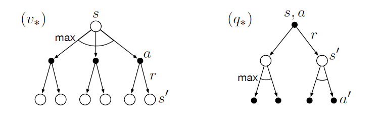

注意：回溯图中的曲线表示在策略下选择最大值而不是平均值。

对于有限MDP，贝尔曼最优方程有独立于策略的唯一解。实际上这是一个方程组，有n个状态就有n个方程。如果动态变化特性p一直，那么原则上可以解方程求出 $v_{*}(s)$ 。

有了 $v_{*}(s)$ 就可以很容易确定最佳策略。对于每个状态 s ，存在一些动作可以在贝尔曼最优方程的条件下产生最大价值。只需要把它们出现的概率设为正值，其余为0即可，这就是最佳策略。

对于 $v_{*}(s)$ 来说单步搜索最优动作就是全局最优动作。一般来说，单步搜索（贪心策略）的动作是仅基于当前而不考虑未来的，其选择是基于短期的结果。而对于 $v_{*}(s)$ 来说，虽然评估的是短期的结果，但从长期来看也是最优的，这就是因为 $v_{*}(s)$ 已经包含了未来产生回报的影响。定义 $v_{*}(s)$ 的目的就是把最优的全局回报期望值转化为每个状态1对应的一个当前局部量的计算，一次单步搜索就可以产生全局最优的动作序列。

有了 $q_{*}$ 更容易确定最佳策略，甚至不需要单步搜索。对于任意状态s，只要找到使 $v_{*}(s)$ 最大化的动作a就可以了。$q_{*}$ 将全局回报期望转换成对应每个“状态，动作”的一个当前局部量。

显示求解贝尔曼方程是不实际的，因为：

- 无法准确知道环境的动态变化特性p
- 没有足够的计算资源
- 不满足马尔可夫性质

强化学习中，就需要设计和实现各种近似算法，来求出贝尔曼方程的近似解。

## Markov Reward Process 

Definition of MRP

- S is a (finite) set of states
- P is dynamics/transition model that specifies P:  $P\left(S_{t+1}=s^{\prime} \mid S_{t}=s\right)$
- R is a reward function: $ R\left(S_{t}=s\right)=\mathbb{E}\left[R_{t+1} \mid S_{t}=s\right]$
- Discount rate: $\gamma \in[0,1]$

If define number of states, R can be a vector

R是奖励函数，是期望，是到达某个状态后可以获得的收益。马尔可夫奖励过程就像是随波逐流的小船，按照P流动（小船是没有动力的，P是环境的状态转移特性），按照R获得收益。

**Example of MRP**

Reward: +5 in s1, +10 in s7, 0 in all other states.

So that we can represent R = [5; 0; 0; 0; 0; 0; 10]

Sample returns G for a 4-step episodes with $\gamma$ = 1/2

- return for s4; s5; s6; s7 : $0+\frac{1}{2} \times 0+\frac{1}{4} \times 0+\frac{1}{8} \times 10=1.25$
- return for s4; s3; s2; s1 : $0+\frac{1}{2} \times 0+\frac{1}{4} \times 0+\frac{1}{8} \times 5=0.625$
- return for s4; s5; s6; s6 : = 0

**Analytic solution（解析法）for value of MRP**
$$
V=(I-\gamma P)^{-1} R
$$

- Matrix inverse takes the complexity O(N3) for N states
- Only possible for a small MRPs
- 当状态数量很多时，矩阵求逆的复杂度是非常高的。

**Iterative Algorithm（迭代算法）for value of MRP**

- Dynamic Programming
- Monte-Carlo evaluation
- Temporal-Difference learning

**Monte Carlo Algorithm**

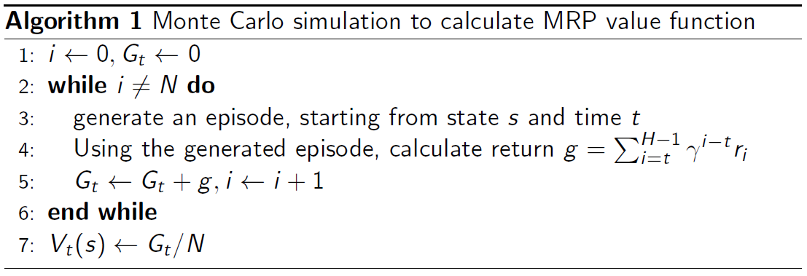

蒙特卡洛方法就是对全部return取平均的方法 。

Iterative Algorithm for Computing Value of a MRP

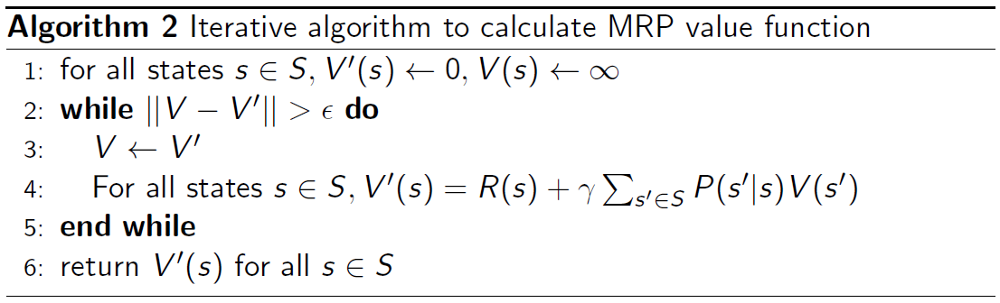

将贝尔曼方程作为update，不断地迭代更新，直到状态变化不大时返回价值。

## Markov Decision Process

Definition of MDP

- S is a finite set of states
- A is a finite set of actions
- $P^{a}$ is dynamics/transition model for each action: $P\left(s_{t+1}=s^{\prime} \mid s_{t}=s, a_{t}=a\right)$
- R is a reward function: $R\left(S_{t}=s, A_{t}=a\right)=\mathbb{E}\left[R_{t+1} \mid S_{t}=s, A_{t}=a\right]$
- Discount rate: $\gamma \in[0,1]$

MDP is a tuple: $(S, A, P, R, \gamma)$

对于MRP,就像随波逐流的小船，对于MDP，就像人控制的小船，避免了船随波逐流，可以尽可能多地获得收益。

# DP（Dynamic Programming）

## Introduction

Dynamic Programming is a very general solution method for problems which have two properties:

- Optimal substructure

    Principle of optimality applies

    Optimal solution can be decomposed into subproblems

- Overlapping subproblems

    Subproblems recur many times

    Solutions can be cached and reused

Markov decision processes satisfy both properties:

- Bellman equation gives recursive decomposition
- Value function stores and reuses solutions

Prediction (evaluate a given policy): 

- Input: MDP $<\mathcal{S}, \mathcal{A}, \mathcal{P}, \mathcal{R}, \gamma>$ and policy $\pi$
- Output: value function $v_{\pi}$

Control (search the optimal policy):

- Input: MDP $<\mathcal{S}, \mathcal{A}, \mathcal{P}, \mathcal{R}, \gamma>$ 

- Output: optimal value function $v_{*}$ and optimal policy $\pi_{*}$

预测和控制是MDP的两个核心问题。预测就是计算价值函数；控制就是寻找最佳策略，计算对应的最佳价值函数。两个问题可以通过动态规划解决。

## Policy Evaluation

Objective: Evaluate a given policy $\pi$ for a MDP

# Model-free RL

## Introduction

**Model-free prediction and control:** Estimate and optimize value function of an **unknown** MDP

In a lot of real-world problems, MDP model is either unknown or known by too big or too complex to use, like Atari Game, Game of Go, Helicopter, Portfolio management, etc.

**Model-free RL:** Learning by interaction

- Model-free RL can solve the problems through interaction with the environment
- No more direct access to the known Dynamics and Rewards function of the environment
- Trajectories/episodes are collected by the agent's interaction with the environment, each contains: 

$$
\left\{S_{1}, A_{1}, R_{1}, S_{2}, A_{2}, R_{2}, \ldots, S_{T}, A_{T}, R_{T}\right\}
$$

Model-free RL 从agent和环境交互过程中采集到信息，并用于改进策略，使收益最大化，而不需要完备的环境模型。

## Model-free Prediction

# Monte Carlo Methods

## Monte Carlo Prediction

- Return: $G_{t} = R_{t+1}+\gamma R_{t+2}+\gamma^{2} R_{t+3}+\cdots+\gamma^{k} R_{t+k+1}$
- State-value function: $v_{\pi}(s)=\mathbb{E}_{\tau \sim \pi}\left[G_{t} \mid S_{t}=s\right]$, expectation over episodes $\tau$ generated by policy $\pi$
- MC simulation: we can simply sample a lot of episodes, compute the actual returns for all the episodes, then average them
- MC prediction uses empirical mean return instead of expected return
- MC doesn't require MDP Dynamics/Rewards, or bootstrapping
- Only applied to episodic MDP

MC使用经验数据去近似估计期望数据，即对所有经过状态 s 之后产生的回报进行平均，随着越来越多的回报被观察到，平均值会收敛于期望值（The average should converge to the expected value）。

### Two MC Methods

Visit: Each occurrence of state s in an episode is called a visit to s

First-visit MC method: 首次访问型MC算法是用状态 s 的首次访问的回报的平均值去估计 $v_{\pi}(s)$。

Every-visit MC method: 每次访问型MC算法是用状态 s 的所有访问的回报的平均值去估计 $v_{\pi}(s)$。

These two Monte Carlo (MC) methods are very similar but have slightly different theoretical properties. First-visit MC has been most widely studied, dating back to the 1940s. Every-visit MC extends more naturally to function approximation and eligibility traces.

### First-visit MC Prediction

