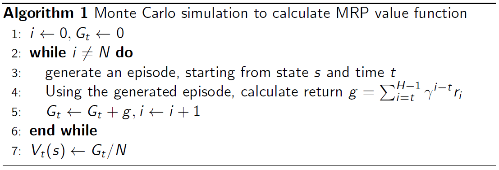
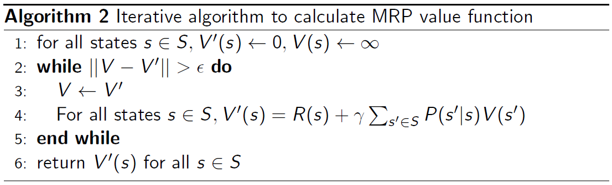

# Markov Decision Processes

## Introduction

- MDPs are a classical formalization of sequential decision making
- Actions influence immediate rewards, subsequent states, and future rewards
- MDPs involve delayed reward
- Need to trade of immediate and delayed reward

MDP是序列决策的表达形式，其当前动作不光影响及时收益，同时影响后续的状态和未来收益，因此涉及到延迟收益，需要权衡及时收益延迟收益。

## The Agent–Environment interaction

- agent: the learner and decision maker
- Environment: everything outside the agent

Markov Decision Process can model a lot of real-world problem. It formally describes the framework of reinforcement learning

Under MDP, the environment is fully observable

- Optimal control primarily deals with continuous MDPs
- Partially observable problems can be converted into MDPs

agent和环境持续交互：agent得到一个状态后，采取一个动作，环境对此做出响应，并进入下一个状态，把下个状态传回给agent。环境也会产生一个收益，通常是特定数值，也就是agent在动作选择过程中想要最大化的目标。这个交互过程可以通过马尔可夫决策过程表示。在MDP中，环境是全部可观测的，部分观测问题也可转换为MDP问题。

- 状态集 $S_{t} \in \mathcal{S}$: each time step t, agent receives the environment’s state
- 动作集 $A_{t} \in \mathcal{A}(s)$: agent on that basis selects an action on that basis
- 收益集 $R_{t+1} \in \mathcal{R} \subset \mathbb{R}$: as a consequence of its action, the agent receives a numerical reward

（使用$R_{t+1}$是为了强调下一时刻的收益和下一时刻的状态是被环境一起决定的，但文献中也会使用$R_{t}$）

## Dynamics function P

有限MDP中，随机变量$S_{t}$和$R_{t}$具有定义明确的离散概率分布，并仅与前继的状态和动作有关。在给定s和a后，$s^{\prime}$ 和 $r$ 在t时刻出现的概率用函数p表示：
$$
p\left(s^{\prime}, r \mid s, a\right) \doteq \operatorname{Pr}\left \{S_{t}=s^{\prime}, R_{t}=r \mid S_{t-1}=s, A_{t-1}=a\right \}
$$

函数p定义了MDP的dynamics（动态特性），函数p：$\mathcal{S} \times \mathcal{R} \times \mathcal{S} \times \mathcal{A} \rightarrow[0,1]$是有四个参数的确定性函数。并且函数p为每个s和a的选择都指定了一个概率分布，满足归一性：
$$
\sum_{s^{\prime} \in \mathcal{S}} \sum_{r \in \mathcal{R}} p\left(s^{\prime}, r \mid s, a\right)=1, \text { for all } s \in \mathcal{S}, a \in \mathcal{A}(s)
$$

-   State-transition probabilities（三参数函数p：$\mathcal{S} \times \mathcal{S} \times \mathcal{A} \rightarrow[0,1]$）

$$
p\left(s^{\prime} \mid s, a\right) \doteq \operatorname{Pr}\left\{S_{t}=s^{\prime} \mid S_{t-1}=s, A_{t-1}=a\right\}=\sum_{r \in \mathcal{R}} p\left(s^{\prime}, r \mid s, a\right)
$$

​		状态转移概率函数：不考虑收益，只考虑状态的转移。State transition matrix P：
$$
P=\left[\begin{array}{cccc}P\left(s_{1} \mid s_{1}\right) & P\left(s_{2} \mid s_{1}\right) & \ldots & P\left(s_{N} \mid s_{1}\right) \\P\left(s_{1} \mid s_{2}\right) & P\left(s_{2} \mid s_{2}\right) & \ldots & P\left(s_{N} \mid s_{2}\right) \\\vdots & \vdots & \ddots & \vdots \\P\left(s_{1} \mid s_{N}\right) & P\left(s_{2} \mid s_{N}\right) & \ldots & P\left(s_{N} \mid s_{N}\right)\end{array}\right]
$$

-   Expected rewards for state–action pairs（双参数函数r：$\mathcal{S} \times \mathcal{A}  \rightarrow \mathbb{R}$）

$$
r(s, a) \doteq \mathbb{E}\left[R_{t} \mid S_{t-1}=s, A_{t-1}=a\right]=\sum_{r \in \mathcal{R}} r \sum_{s^{\prime} \in \mathcal{S}} p\left(s^{\prime}, r \mid s, a\right)
$$

​		“状态-动作”二元组的期望收益

-   Expected rewards for state–action–next-state triples（三参数函数r：$\mathcal{S} \times \mathcal{A} \times \mathcal{S} \rightarrow \mathbb{R}$）
    $$
    r\left(s, a, s^{\prime}\right) \doteq \mathbb{E}\left[R_{t} \mid S_{t-1}=s, A_{t-1}=a, S_{t}=s^{\prime}\right]=\sum_{r \in \mathcal{R}} r \frac{p\left(s^{\prime}, r \mid s, a\right)}{p\left(s^{\prime} \mid s, a\right)}
    $$
    “状态-动作-后继状态”三元组的期望收益

    

## Markov Property

The history of states: $ h_{t}=\{s_{1}, s_{2}, s_{3}, \ldots, s_{t}\} $

State $s_{t}$ is Markovian if and only if: 
$$
p\left(s_{t+1} \mid s_{t}\right)=p\left(s_{t+1} \mid h_{t}\right)
$$

$$
p\left(s_{t+1} \mid s_{t}, a_{t}\right)=p\left(s_{t+1} \mid h_{t}, a_{t}\right)
$$

状态这个参数是包含了历史信息的。对于MDP，状态仅取决于前一个状态和前一个动作而与更早的状态和动作完全无关，因此状态被认为具有马尔可夫性质。

## Markov Process/Markov Chain（马尔可夫链）

### Example of MP

Sample episodes starting from s3

s3; s4; s5; s6; s6

s3; s2; s3; s2; s1

s3; s4; s4; s5; s5

有了马尔可夫链，就可以取样，获得很多的轨迹。

## Markov Reward Process （马尔可夫奖励过程）

Markov Reward Process is a Markov Chain + reward

Definition of Markov Reward Process (MRP)

- S is a (finite) set of states
- P is dynamics/transition model that specifies P:  $P\left(s_{t+1}=s^{\prime} \mid s_{t}=s\right)$
- R is a reward function: $R\left(s_{t}=s\right)=\mathbb{E}\left[r_{t} \mid s_{t}=s\right]$
- Discount factor: $\gamma \in[0,1]$

If define number of states, R can be a vector

马尔可夫奖励过程的状态集合和状态转移和马尔可夫链相同。R是奖励函数，是期望，是到达某个状态后可以获得的收益。D是折扣率。马尔可夫奖励过程就像是随波逐流的小船，按照P流动，按照R获得收益。

### Return and Value function

#### Definition of Horizon

- Number of maximum time steps in each episode
- Can be infinite, otherwise called infinite Markov (reward) Process

#### Definition of Return

- Discounted sum of rewards from time step t to horizon

$$
G_{t}=R_{t+1}+\gamma R_{t+2}+\gamma^{2} R_{t+3}+\gamma^{3} R_{t+4}+\ldots+\gamma^{T-t-1} R_{T}
$$

- 从公式中可以发现，越往后的收益折扣的越多，因为我们更期待更快地获得收益。

#### Definition of  value function Vt (s) for a MRP

Expected return from t in state s
$$
\begin{aligned}
V_{t}(s) &=\mathbb{E}\left[G_{t} \mid s_{t}=s\right] \\
&=\mathbb{E}\left[R_{t+1}+\gamma\left|R_{t+2}+\gamma^{2} R_{t+3}+\ldots+\gamma^{T-t-1} R_{T}\right| s_{t}=s\right]
\end{aligned}
$$

- Present value of future rewards
- 价值函数就是Return的期望，也就是进入某个状态后，有可能在未来获得多少价值。

#### Why Discount Factor 

- Avoids infinite returns in cyclic Markov processes

- Uncertainty about the future may not be fully represented

- If the reward is financial, immediate rewards may earn more interest than delayed rewards Animal/human behavior shows preference for immediate reward

- It is sometimes possible to use undiscounted Markov reward processes

    $\gamma$ = 0: Only care about the immediate reward

    $\gamma$ = 1: Future reward is equal to the immediate reward

马尔可夫链是带环的，需要避免无限的return。为了尽可能快地得到收益，而不是在未来某个时间获得收益。

### Example of MRP

Reward: +5 in s1, +10 in s7, 0 in all other states.

So that we can represent R = [5; 0; 0; 0; 0; 0; 10]

定义好每个状态的收益后，R就可以用向量表示。

Sample returns G for a 4-step episodes with $\gamma$ = 1/2

- return for s4; s5; s6; s7 : $0+\frac{1}{2} \times 0+\frac{1}{4} \times 0+\frac{1}{8} \times 10=1.25$
- return for s4; s3; s2; s1 : $0+\frac{1}{2} \times 0+\frac{1}{4} \times 0+\frac{1}{8} \times 5=0.625$
- return for s4; s5; s6; s6 : = 0

### Bellman Equation

$$
V(s)=\underbrace{R(s)}_{\text {Immediate reward }}+\underbrace{\gamma \sum_{s^{\prime} \in S} P\left(s^{\prime} \mid s\right) V\left(s^{\prime}\right)}_{\text {Discounted sum of future reward }}
$$

Bellman equation describes the iterative relations of states

贝尔曼方程表示了状态之间的递推关系。
$$
\left[\begin{array}{c}
V\left(s_{1}\right) \\
V\left(s_{2}\right) \\
\vdots \\
V\left(s_{N}\right)
\end{array}\right]=\left[\begin{array}{c}
R\left(s_{1}\right) \\
R\left(s_{2}\right) \\
\vdots \\
R\left(s_{N}\right)
\end{array}\right]+\gamma\left[\begin{array}{cccc}
P\left(s_{1} \mid s_{1}\right) & P\left(s_{2} \mid s_{1}\right) & \ldots & P\left(s_{N} \mid s_{1}\right) \\
P\left(s_{1} \mid s_{2}\right) & P\left(s_{2} \mid s_{2}\right) & \ldots & P\left(s_{N} \mid s_{2}\right) \\
\vdots & \vdots & \ddots & \vdots \\
P\left(s_{1} \mid s_{N}\right) & P\left(s_{2} \mid s_{N}\right) & \ldots & P\left(s_{N} \mid s_{N}\right)
\end{array}\right]\left[\begin{array}{c}
V\left(s_{1}\right) \\
V\left(s_{2}\right) \\
\vdots \\
V\left(s_{N}\right)
\end{array}\right]
$$

$$
V=R+\gamma P V
$$

#### Analytic solution（解析法）for value of MRP

$$
V=(I-\gamma P)^{-1} R
$$

- Matrix inverse takes the complexity O(N3) for N states
- Only possible for a small MRPs
- 当状态数量很多时，矩阵求逆的复杂度是非常高的。所以解析法只适用于小型MRP。

#### Iterative Algorithm（迭代算法）for value of MRP

- Dynamic Programming
- Monte-Carlo evaluation
- Temporal-Difference learning

##### Monte Carlo Algorithm

蒙特卡洛方法就是对全部return取平均的方法 。

##### Iterative Algorithm for Computing Value of a MRP

将贝尔曼方程作为update，不断地迭代更新，直到状态变化不大时返回价值。

## Markov Decision Process (MDP)

Markov Decision Process is Markov Reward Process with decisions.

Definition of MDP

- S is a finite set of states
- A is a finite set of actions
- $P^{a}$ is dynamics/transition model for each action: $P\left(s_{t+1}=s^{\prime} \mid s_{t}=s, a_{t}=a\right)$
- R is a reward function: $R\left(s_{t}=s, a_{t}=a\right)=\mathbb{E}\left[r_{t} \mid s_{t}=s, a_{t}=a\right]$
- Discount factor: $\gamma \in[0,1]$

MDP is a tuple: $(S, A, P, R, \gamma)$

马尔可夫决策过程比马尔可夫奖励过程多了决策，也就是当前的状态S和采取的动作A共同影响P和R。

### Policy in MDP

Give a state, specify a distribution over actions

Policy : $\pi(a \mid s)=P\left(a_{t}=a \mid s_{t}=s\right)$

Policies are stationary (time-independent), $A_{t} \sim \pi(a \mid s)$ for any $t>0$

Given an MDP and a policy $\pi$
$$
\begin{aligned}
P^{\pi}\left(s^{\prime} \mid s\right) &=\sum_{a \in A} \pi(a \mid s) P\left(s^{\prime} \mid s, a\right) \\
R^{\pi}(s) &=\sum_{a \in A} \pi(a \mid s) R(s, a)
\end{aligned}
$$
当给出MDP和策略函数后，可以将MDP转换为MRP。

### Comparison of MP/MRP and MDP

### Value function for MDP

The state-value function $V^{\pi}(s)$ of an MDP is the expected return starting from state s, and following policy $\pi$
$$
v^{\pi}(s)=\mathbb{E}_{\pi}\left[G_{t} \mid s_{t}=s\right]
$$
The action-value function $q^{\pi}(s, a)$ is the expected return starting from state s, taking action a, and then following policy $\pi$
$$
q^{\pi}(s, a)=\mathbb{E}_{\pi}\left[G_{t} \mid s_{t}=s, A_{t}=a\right]
$$
We have the relation between $v^{\pi}(s)$ and $q^{\pi}(s, a)$
$$
v^{\pi}(s)=\sum_{a \in A} \pi(a \mid s) q^{\pi}(s, a)
$$

### Bellman Expectation Equation

The state-value function can be into immediate reward plus discounted value of the successor state
$$
v^{\pi}(s)=E_{\pi}\left[R_{t+1}+\gamma v^{\pi}\left(s_{t+1}\right) \mid s_{t}=s\right]
$$
The action-value function can similarly be decomposed
$$
q^{\pi}(s, a)=E_{\pi}\left[R_{t+1}+\gamma q^{\pi}\left(s_{t+1}, A_{t+1}\right) \mid s_{t}=s, A_{t}=a\right]
$$
上面两个等式表达了当前状态和未来状态的关系。
$$
\begin{aligned}
v^{\pi}(s) &=\sum_{a \in A} \pi(a \mid s)\left(R(s, a)+\gamma \sum_{s^{\prime} \in S} P\left(s^{\prime} \mid s, a\right) v^{\pi}\left(s^{\prime}\right)\right) \\
q^{\pi}(s, a) &=R(s, a)+\gamma \sum_{s^{\prime} \in S} P\left(s^{\prime} \mid s, a\right) \sum_{a^{\prime} \in A} \pi\left(a^{\prime} \mid s^{\prime}\right) q^{\pi}\left(s^{\prime}, a^{\prime}\right)
\end{aligned}】=
$$
上面两个等式表达了当前状态的价值和未来价值的关系。

#### Backup Diagram for $V^{\pi}$

#### Backup Diagram for $Q^{\pi}$

#### Example: Navigate the boat

Markov Chain/MRP: Go with river stream

MDP: Navigate the boat

对于MDP，就像人控制的小船，避免了船随波逐流，可以尽可能多地获得收益

## Decision Making in MDP

Prediction (evaluate a given policy): 

- Input: MDP $<\mathcal{S}, \mathcal{A}, \mathcal{P}, \mathcal{R}, \gamma>$ and policy $\pi$ or MRP $<\mathcal{S}, \mathcal{P}^{\pi}, \mathcal{R}^{\pi}, \gamma>$
- Output: value function $V^{\pi}$

Control (search the optimal policy):

- Input: MDP $<\mathcal{S}, \mathcal{A}, \mathcal{P}, \mathcal{R}, \gamma>$ 

- Output: optimal value function $V^{*}$ and optimal policy $\pi^{*}$

预测和控制是MDP的两个核心问题。预测就是计算价值函数；控制就是寻找一个最佳的策略，并计算对应的价值函数。两个问题可以通过动态规划解决。

Dynamic Programming

[^ 1 ]: 
